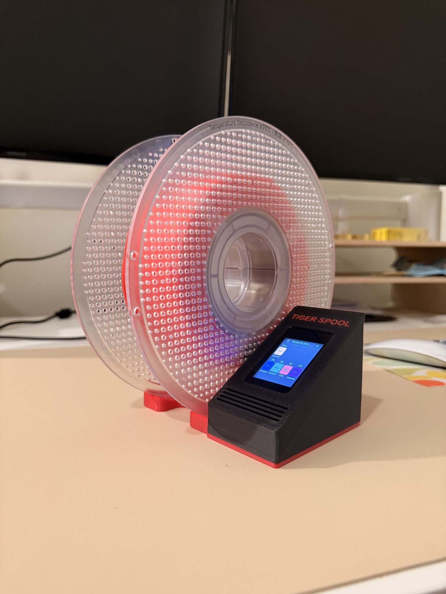
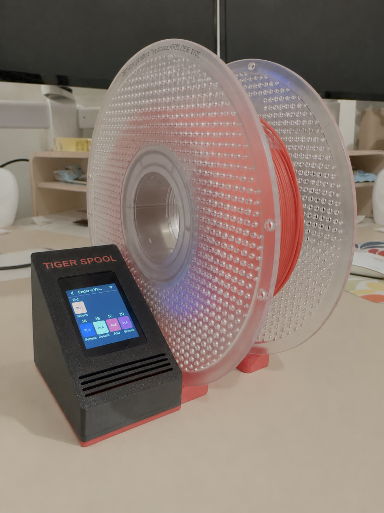
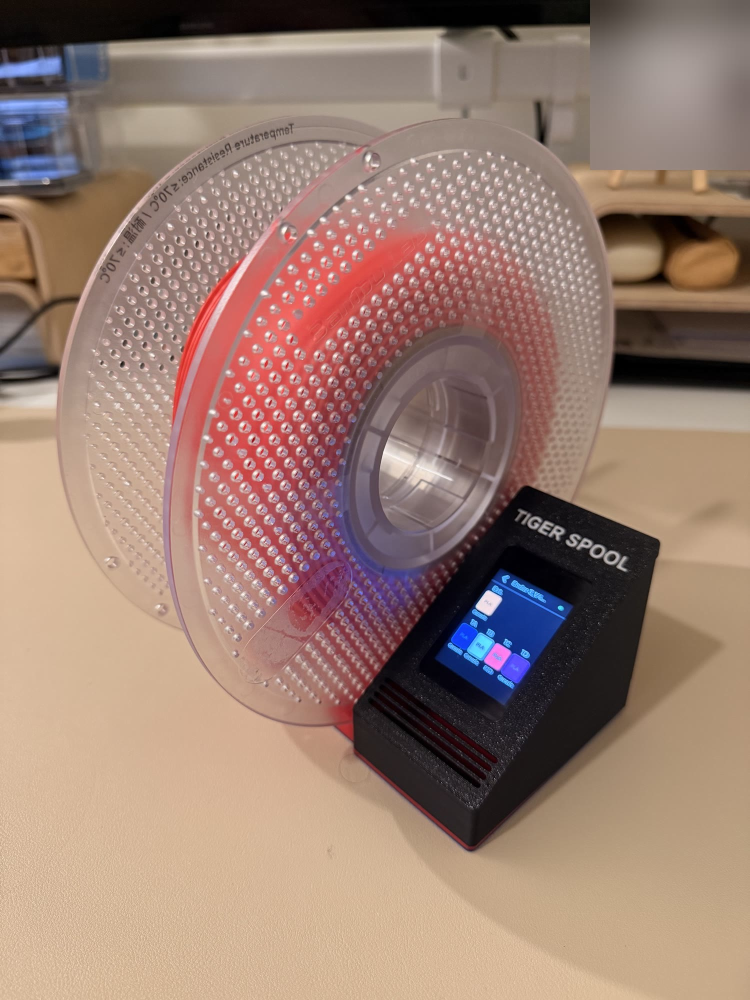
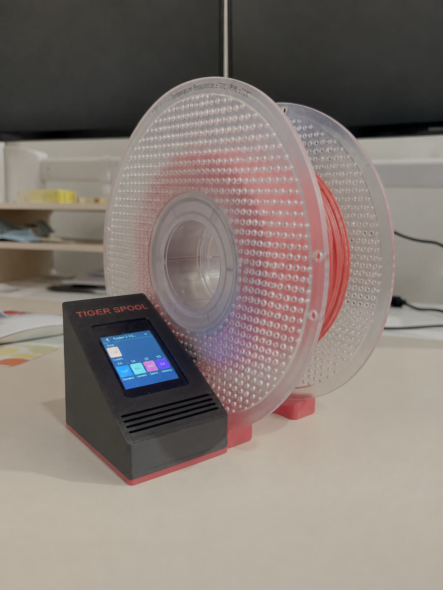
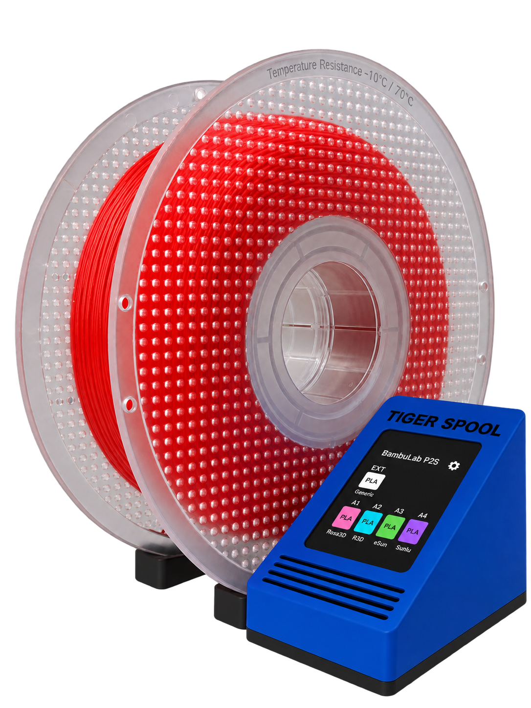
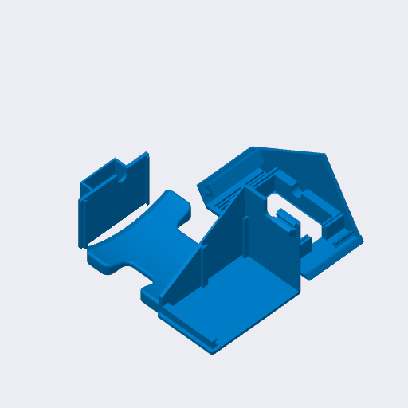
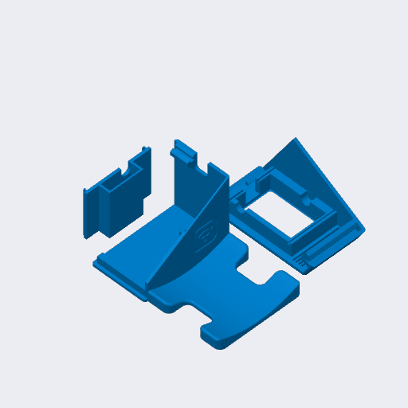
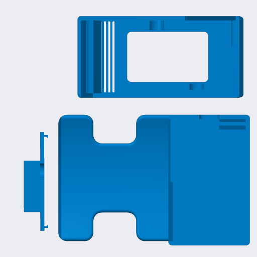
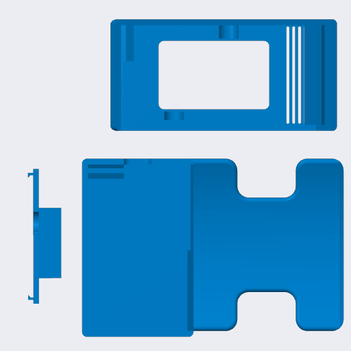

# Desktop stand

| Spool on the left | Spool on the right |
|---|---|
|  |  |
|  |  |

**Print it from MakerWorld:**
[spool on the left](https://makerworld.com/models/3360492-tigerspool-desktop-stand-spool-on-the-left) ·
[spool on the right](https://makerworld.com/models/3360619-tigerspool-desktop-stand-spool-on-the-right)

A free-standing stand for the bench or the desk. It is not attached to any
printer, so it fits every one of them - the base TigerSpool, which the
[printer integrations](../README.md) build on.

It comes in two mirrored versions: the spool rests **on the left** of the
screen, or **on the right**. Pick the one that suits where it sits.

## Files

Each version is three parts - the base, the display and the display cover.

| | Spool on the left | Spool on the right |
|---|---|---|
| Bambu Studio, every part on one plate | [`tigerspool-desk-left-full.3mf`](BambuStudio/tigerspool-desk-left-full.3mf) | [`tigerspool-desk-right-full.3mf`](BambuStudio/tigerspool-desk-right-full.3mf) |
| Creality Print, every part on one plate | [`tigerspool-desk-left-full.3mf`](CrealityPrint/tigerspool-desk-left-full.3mf) | [`tigerspool-desk-right-full.3mf`](CrealityPrint/tigerspool-desk-right-full.3mf) |
| Base, bare part | [`tigerspool-desk-left-base.3mf`](OriginalFiles/Left/tigerspool-desk-left-base.3mf) | [`tigerspool-desk-right-base.3mf`](OriginalFiles/Right/tigerspool-desk-right-base.3mf) |
| Display, bare part | [`tigerspool-desk-left-display.3mf`](OriginalFiles/Left/tigerspool-desk-left-display.3mf) | [`tigerspool-desk-right-display.3mf`](OriginalFiles/Right/tigerspool-desk-right-display.3mf) |
| Display cover, bare part | [`tigerspool-desk-left-display-cover.3mf`](OriginalFiles/Left/tigerspool-desk-left-display-cover.3mf) | [`tigerspool-desk-right-display-cover.3mf`](OriginalFiles/Right/tigerspool-desk-right-display-cover.3mf) |

The slicer projects carry the orientation, the supports and the settings below.
The bare parts carry geometry only, for any other slicer.

## Assembly

No screws, no inserts, no hardware to buy for the case: it is 100 % 3D
printed. The board and the reader go into the printed parts, and the parts
assemble on their own. Every part is designed to print without supports.

## Print settings

PLA, 0.4 mm nozzle and 15 % infill everywhere. The rest is what each project
was saved with:

| Project | Printer | Layer | Walls | Supports |
|---|---|---|---|---|
| Bambu Studio, left | A1 mini | 0.20 mm | 2 | none |
| Bambu Studio, right | A1 mini | 0.20 mm | 3 | none |
| Creality Print, left | Hi | 0.24 mm | 2 | none |
| Creality Print, right | K2 Pro | 0.20 mm | 3 | tree, painted on where needed |

The display part uses a second PLA colour for its details; the projects assign
it already. Print it in one colour and it still works.

## The parts

| Spool on the left | Spool on the right |
|---|---|
|  |  |

### From above

| Spool on the left | Spool on the right |
|---|---|
|  |  |

The plate pictures are the slicers' own previews, taken out of the projects;
the Creality Print ones and a render of each version are in [`Images/Left/`](Images/Left/) and [`Images/Right/`](Images/Right/) too.

## Source

[`Source/tigerspool-desk.f3d`](Source/tigerspool-desk.f3d) - the Fusion design
both versions come from.
