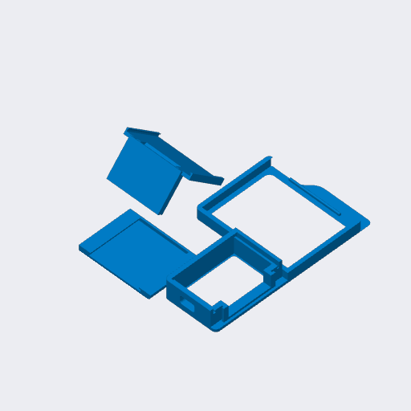

# Bambu Lab A1, A2 and A2L

A TigerSpool case made for the Bambu Lab A1, A2 and A2L. It clips onto the
printer's screen.

## Parts

| Part | File |
|---|---|
| Frame | [`tigerspool-a1-a2-frame.3mf`](OriginalFiles/tigerspool-a1-a2-frame.3mf) |
| Cover, with the logo | [`tigerspool-a1-a2-cover.3mf`](OriginalFiles/tigerspool-a1-a2-cover.3mf) |
| RFID reader holder | [`tigerspool-a1-a2-rfid.3mf`](OriginalFiles/tigerspool-a1-a2-rfid.3mf) |
| Everything, one plate (Bambu Studio) | [`tigerspool-a1-a2-full.3mf`](BambuStudio/tigerspool-a1-a2-full.3mf) |

The bare parts carry geometry only, for any slicer; the Bambu Studio project
carries the orientation, the supports and the settings below.

## Print settings

Saved from Bambu Studio for an A1 mini, 0.4 mm nozzle.

| Setting | Value |
|---|---|
| Layer height | 0.20 mm |
| Walls | 3 |
| Infill | 15 % |
| Supports | normal, placed by hand - they are in the project |
| Material | PLA (Bambu PLA Basic in the project), two colours for the cover logo |

## Source

[`Source/tigerspool-a1-a2.f3d`](Source/tigerspool-a1-a2.f3d) - the Fusion design.
