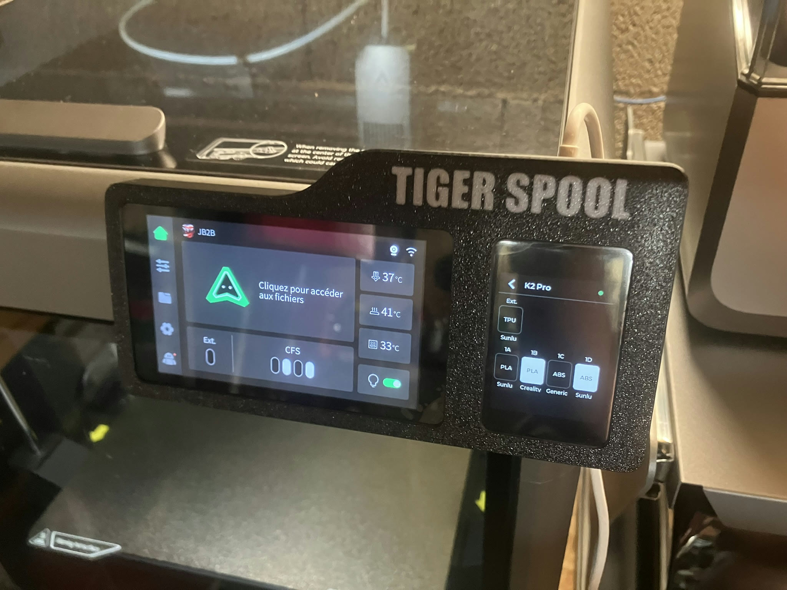
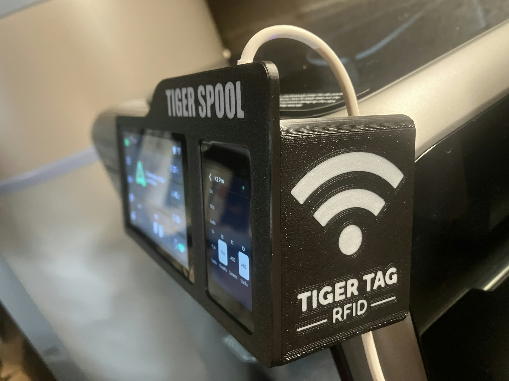
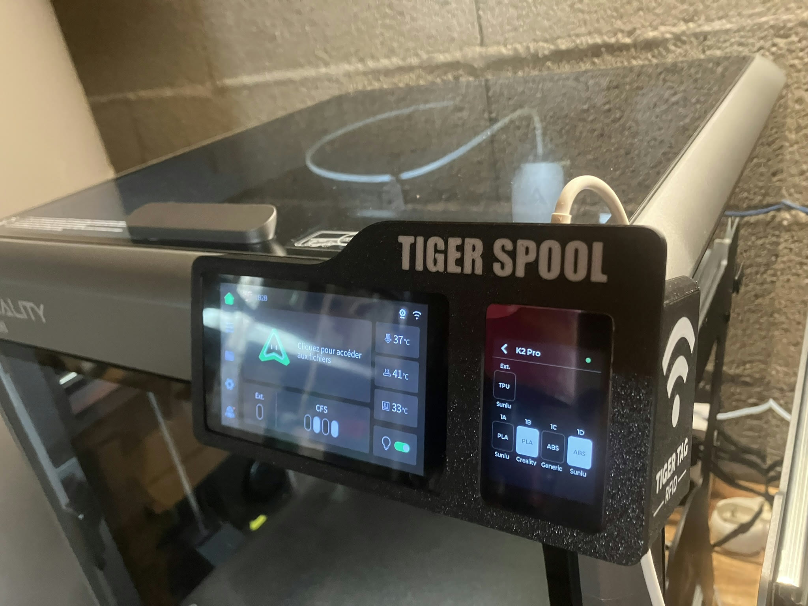
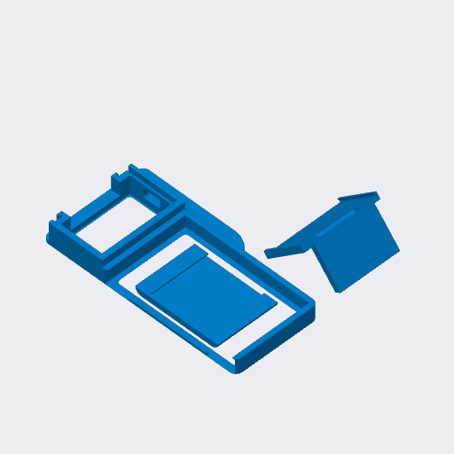

# Creality K2 and K2 Pro

 

A TigerSpool case made for the Creality K2 and K2 Pro. It clips onto the
printer's own touchscreen, with the TigerSpool screen beside it and the reader
on the side.

## Parts

| Part | File |
|---|---|
| Frame | [`tigerspool-k2-frame.3mf`](OriginalFiles/tigerspool-k2-frame.3mf) |
| Cover | [`tigerspool-k2-cover.3mf`](OriginalFiles/tigerspool-k2-cover.3mf) |
| RFID reader holder | [`tigerspool-k2-rfid.3mf`](OriginalFiles/tigerspool-k2-rfid.3mf) |
| Everything, one plate - Creality Print, K2 | [`tigerspool-k2-full.3mf`](CrealityPrint/tigerspool-k2-full.3mf) |
| Everything, one plate - Creality Print, K2 Pro | [`tigerspool-k2pro-full.3mf`](CrealityPrint/tigerspool-k2pro-full.3mf) |
| Everything, one plate - Bambu Studio | [`tigerspool-k2-full.3mf`](BambuStudio/tigerspool-k2-full.3mf) |

The bare parts carry geometry only, for any slicer; each project carries the
orientation, the supports and the settings below.

## Print settings

PLA, 0.4 mm nozzle, 0.20 mm layers and 15 % infill in every project.

| Project | Printer | Walls | Supports |
|---|---|---|---|
| Creality Print | K2 | 2 | none |
| Creality Print | K2 Pro | 3 | none |
| Bambu Studio | A1 mini | 3 | normal, placed by hand |

## Source

[`Source/tigerspool-k2.f3d`](Source/tigerspool-k2.f3d) - the Fusion design.
