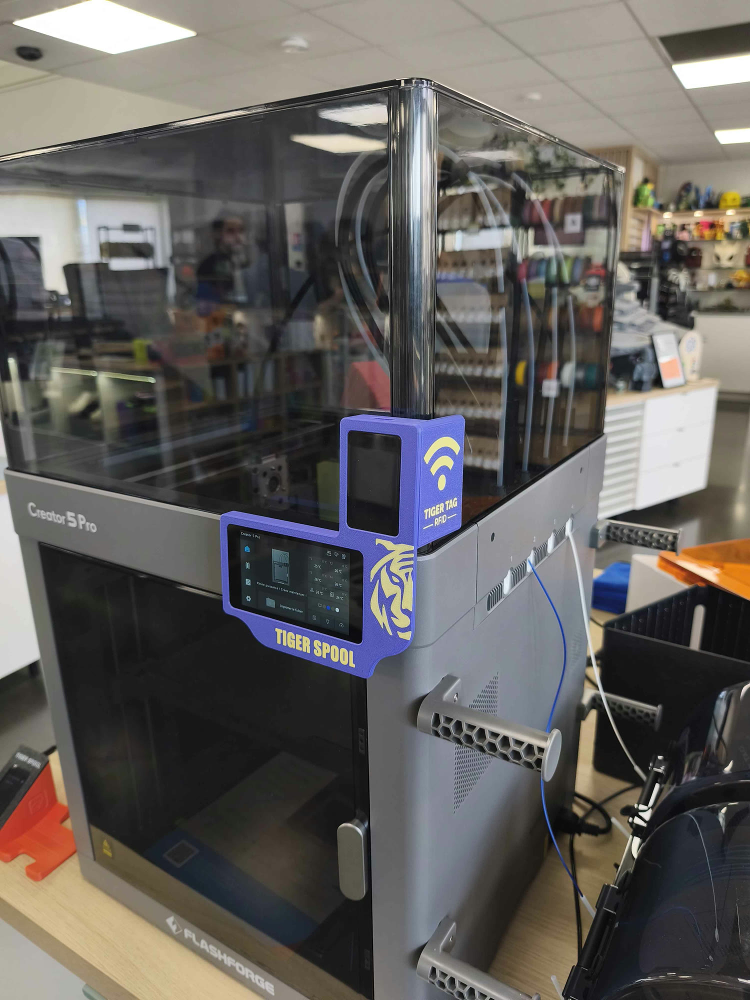
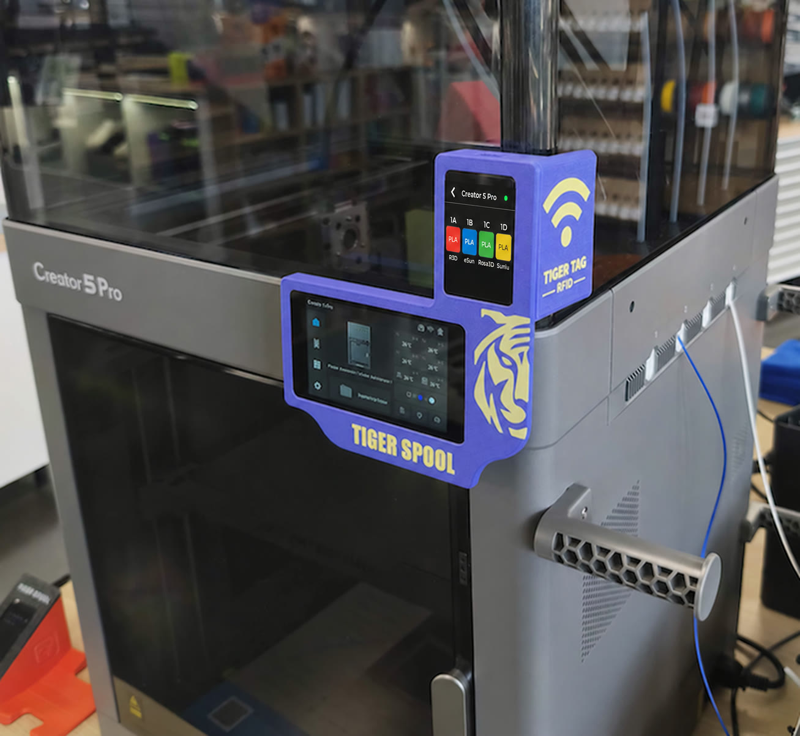
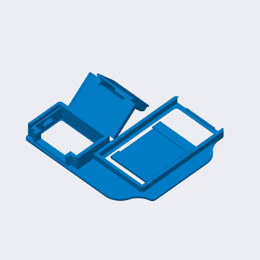

# FlashForge Creator 5 and Creator 5 Pro

 

A TigerSpool case made for the FlashForge Creator 5 and Creator 5 Pro. It
clips onto the printer's screen.

## Parts

| Part | File |
|---|---|
| Frame | [`tigerspool-creator5-frame.3mf`](OriginalFiles/tigerspool-creator5-frame.3mf) |
| Cover | [`tigerspool-creator5-cover.3mf`](OriginalFiles/tigerspool-creator5-cover.3mf) |
| RFID reader holder | [`tigerspool-creator5-rfid.3mf`](OriginalFiles/tigerspool-creator5-rfid.3mf) |
| Everything, one plate (Bambu Studio) | [`tigerspool-creator5-full.3mf`](BambuStudio/tigerspool-creator5-full.3mf) |

The bare parts carry geometry only, for any slicer - FlashForge Orca included;
the Bambu Studio project carries the orientation, the supports and the
settings below.

## Print settings

Saved from Bambu Studio for an A1 mini, 0.4 mm nozzle.

| Setting | Value |
|---|---|
| Layer height | 0.20 mm |
| Walls | 3 |
| Infill | 15 % |
| Supports | normal, placed by hand - they are in the project |
| Material | PLA (Bambu PLA Basic in the project), two colours |

