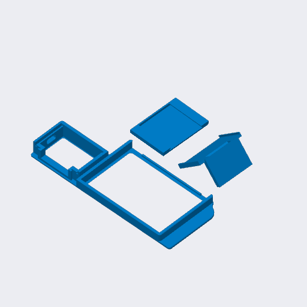

# Anycubic Kobra 3 series

A TigerSpool case made for every Anycubic Kobra 3 model. It clips onto the
printer's screen.

## Parts

| Part | File |
|---|---|
| Frame | [`tigerspool-kobra3-frame.3mf`](OriginalFiles/tigerspool-kobra3-frame.3mf) |
| Cover | [`tigerspool-kobra3-cover.3mf`](OriginalFiles/tigerspool-kobra3-cover.3mf) |
| RFID reader holder | [`tigerspool-kobra3-rfid.3mf`](OriginalFiles/tigerspool-kobra3-rfid.3mf) |
| Everything, one plate (Bambu Studio, ready to print) | [`tigerspool-kobra3-full.3mf`](BambuStudio/tigerspool-kobra3-full.3mf) |

The bare parts carry geometry only, for any slicer; the Bambu Studio project
carries the orientation, the supports and the settings below.

## Print settings

Saved from Bambu Studio for an A1, 0.4 mm nozzle.

| Setting | Value |
|---|---|
| Layer height | 0.20 mm |
| Walls | 2 |
| Infill | 15 % |
| Supports | normal, placed by hand - they are in the project |
| Material | PLA (Bambu PLA Basic in the project), two colours |

## Source

[`Source/tigerspool-kobra3.f3d`](Source/tigerspool-kobra3.f3d) - the Fusion design.
